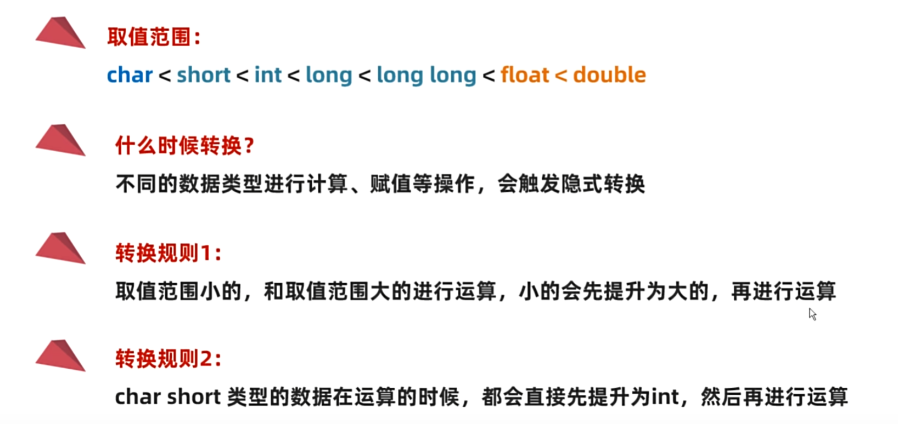

#### 变量
- %d: int
- %f: float
- %s: 字符串
- %c: 字符
- %ld: long
- %lld: long long
- %u: unsigned int
- %zu: size_t
- %td: ptrdiff_t
#### 进制
- 0b: 二进制
- 0: 八进制
- 0x: 十六进制
#### 数据类型
- 整数
  - short: 2字节
  - int: 4字节
  - long: 4字节
  - long long: 8字节
- 浮点数
  - float: 4字节
  - double: 8字节 (双精度, 15位有效数字)
- 字符
  - char: 1字节
#### 标识符
- 硬性要求
  - 由字母、数字、下划线组成
  - 不能以数字开头
  - 不能是关键字
  - 区分大小写
- 软性建议
  - 见名知意
  - 全部小写
  - 代码文件名：单词之间用下划线分隔

#### 键盘录入
- 定义字符串：char str[100] = "david";
- 字符串大小判断：
  - 英文：1字节
  - 中文：2字节
  - 末尾：1字节
- scanf("%d", &str);
- 录入多个参数
  - scanf("%d %d", &a, &b);

#### 运算符
- 隐式转换
  - 把一个取值范围小的，转成取值范围大的：ex: short -> int
  - short char类型在运算时会自动转换为int类型
  - 