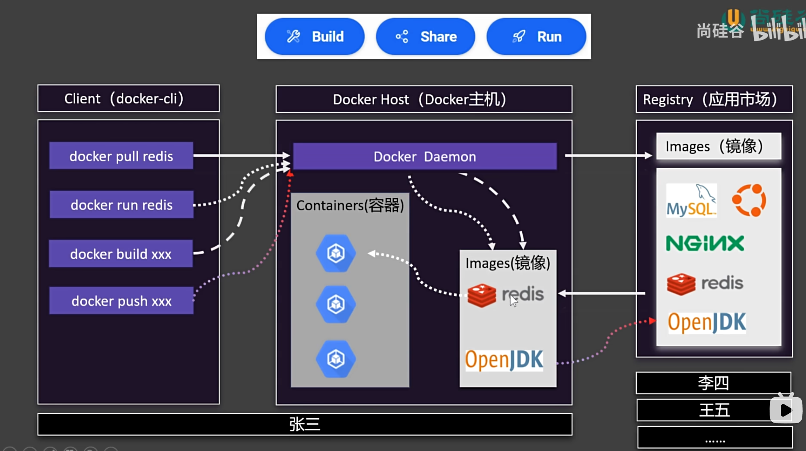
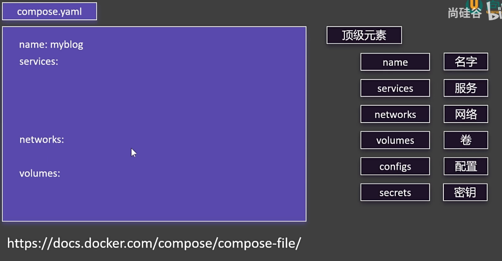
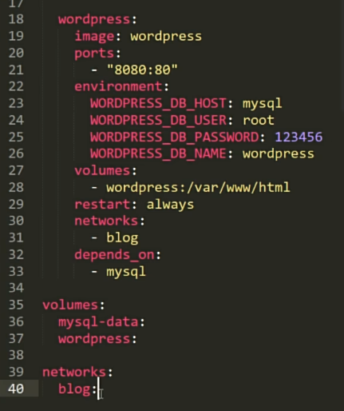
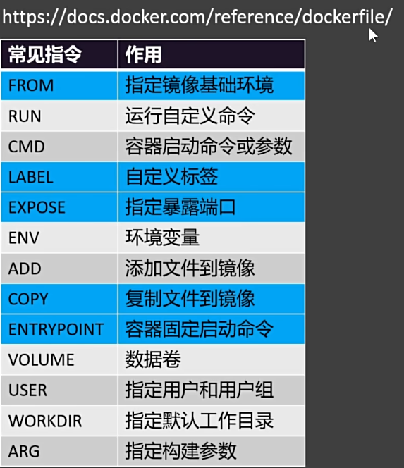

#### Docker
##### 基础知识
- 课件：https://www.yuque.com/leifengyang/sutong/au0lv3sv3eldsmn8
- 基础架构
  - 
- docker安装：
  - `https://docs.docker.com/engine/install/centos/`
- docker自启
  - sudo systemctl enable --now docker
- docker启动：
  - `sudo systemctl start docker`

##### 命令
- 下载镜像相关命令
  - docker search：搜索镜像
  - docker pull：下载镜像
  - docker images：查看本地镜像
  - docker rmi：删除本地镜像
- 容器相关命令
  - docker run：运行容器
    - -d：后台运行
    - --name xxx：指定容器名
    - -p：端口映射
  - docker ps：查看容器
    - -a：查看所有容器（包括已停止的）
    - -q：只显示容器ID
  - docker stop：停止容器
  - docker start：启动容器
  - docker restart：重启容器
  - docker stats：查看容器资源
  - docker logs：查看容器日志
  - docker exec：进入容器
    - -it：交互式进入
  - docker rm：删除容器
- 保存镜像相关命令
  - docker commit：保存镜像
    -  -m：提交信息
    -  -a：作者
    -  -p：提交暂停容器
    -  -c：提交容器时执行命令
  - docker save：导出镜像
    -  -o：导出到文件
  - docker load：导入镜像
    - -i：导入文件
    - -q：静默导入
- 分享镜像相关命令
  - docker login：登录docker
  - docker tag：修改镜像标签
    - 用户名/镜像名:版本
  - docker push 用户名/镜像名:版本：推送镜像

##### Docker存储
- 目录挂载：目录挂载允许将宿主机的特定目录或文件直接挂载到容器的指定路径。比如：讲编辑好的html文件挂载到nginx容器的html目录，这样就可以直接在宿主机上修改html文件，而不需要进入容器内部进行修改。
  - docker run -v /宿主机目录:/容器目录
- 卷映射：卷的设计初衷是提供独立于容器生命周期的持久化存储。
  - docker run -v 卷名:/容器目录
  - 默认卷目录：/var/lib/docker/volumes/<volume_name>/_data
- docker volume ls：查看卷
- docker volume inspect：查看卷详细信息

##### Docker网络
- docker 为每个容器分配唯一ip，使用容器ip+容器端口访问
  - docker container inspect 容器名：查看容器详细信息
- docker image
  - connect：连接容器到网络
  - create xxx：创建网络xxx
  - disconnect：断开容器网络
  - inspect：查看网络详细信息
  - ls：查看网络
  - prune：删除无用网络
  - rm：删除网络
- 例子：
  - docker network create mynet: 创建网络mynet
  - docker run -d -p 88:80 --name app1 --network mynet nginx: 创建容器app1并加入mynet网络
  - 后续可以使用容器名访问容器

##### Docker Compose
- 需要制作compose.yml文件,把容器的启动命令、端口映射、卷挂载等配置写入文件
- docker compose up：上线
  - -d：后台启动
- docker compose down：下线
  - --rmi all：删除镜像
  - -v：删除卷
- docker compose start：启动
- docker compose stop：停止 
- docker compose scale：扩容
- 基本语法:
- 例子：
 
#### Dockerfile
- Dockerfile是一个文本文件，用来配置镜像的构建过程
- 
- docker build -f Dockerfile -t 镜像名:版本 .：构建镜像