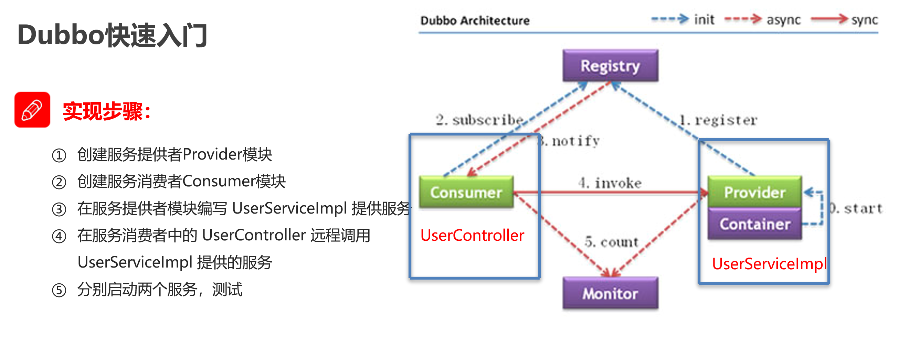

#### Dubbo (有点老，现在被阿里巴巴放弃了，现在使用的是Nacos+SpringCloud)
##### 分布式系统中的相关概念
- 概念：
  - 集群：多台服务器组成一个集群，提供服务
  - 分布式：很多台服务器组成一个分布式系统，提供不同的服务
  - RPC：远程过程调用，一个服务器调用另一个服务器的方法。有许多协议和技术可以实现RPC。 
##### Dubbo快速入门
- Zookeeper：注册中心
- 
##### Dubbo高级特性
- dubbo-admin：监控中心
- **序列化**：所有POJO对象都需要实现serializable接口
- **地址缓存**：
  - 注册中心挂了，服务是否可以正常访问？
  - 可以，因为dubbo服务消费者在第一次调用时，会讲服务提供者的地址缓存到本地，以后在调用时，直接从本地缓存中获取地址，不会再去注册中心获取。
  - 当服务提供者地址发生变化时，注册中心会通知服务消费者。
- **超时与重试**
  - **超时**
    - 服务消费者在调用服务提供者的时候发生了阻塞，等待的清醒，这个时候，服务消费者会一直等待下去
    - 在某个峰值时刻，大量请求都在同时请求服务消费者，会造成线程的大量堆积，势必会造成雪崩
    - dubbo**利用超时机制**来解决问题，设置超时时间，如果超过这个时间，则会断开连接
    - 使用tmeout属性设置超时时间
  - **重试**
    - 设置了超时时间，在这个时间段内，无法完成服务访问，则自动断开连接
    - 如果出现网络抖动，则这一次请求就会失败
    - Dubbo提供了重试机制来避免类似问题的发生
    - 使用retries属性设置重试次数
- **多版本**
  - 灰度发布：当出现新功能时，会让一部分用户先使用新功能，用户反馈没问题时，再将用户迁移到新功能
  - dubbo中可以通过version属性来实现灰度发布
- **复杂均衡**
  - Random：按权重随机，按照权重来随机选择服务提供者
  - RoundRobin：轮询，按照权重来轮询选择服务提供者
  - LeastActive：最少活跃调用数，选择活跃数最少的服务提供者
  - ConsistentHash：一致性hash，相同参数的请求总是发到同一个服务提供者
- **集群容错**
  - Failover Cluster：失败自动切换，当出现失败，会自动切换到其他服务提供者，默认重试2次，使用retries属性设置重试次数,一般用于读操作
  - Failfast Cluster: 快速失败，只发起一次调用，失败立即报错，一般用于写操作
  - Failsafe Cluster: 失败安全，出现异常时，直接忽略，返回空结果
  - Forking Cluster: 并行调用多个服务提供者，只要有一个成功即返回
  - Broadcast Cluster: 广播调用所有提供者，任意一个报错则报错
- ~~**服务降级**~~
  - 在@Reference中设置mock属性
  - mock=force:return null表示消费方对该服务的方法调用直接返回null值，不发起远程调用。
  - mock=fail:return null表示消费方对该服务的方法调用在失败后，再返回null值，不抛异常。