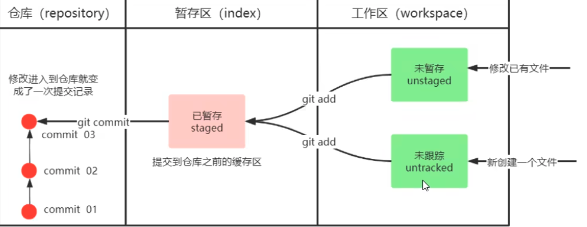
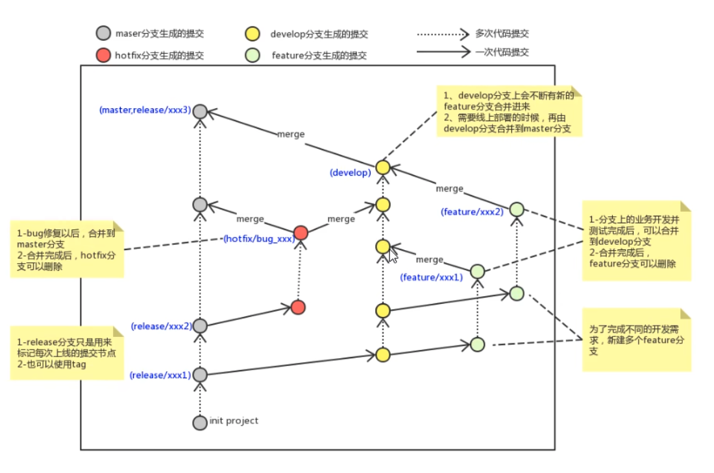
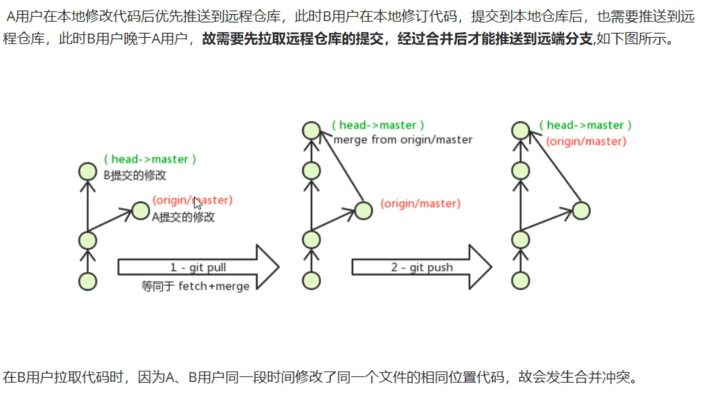

# Git常见命令
- 配置
  - `git config --global user.name "Your Name"`
  - `git config --global user.email "`
- git文件状态
  - 
- 常用指令
  - `git init`
  - `git add .`
  - `git commit -m "message"`
  - `git push`
  - `git pull`
  - `git clone`
  - `git status`
  - `git log`
- 版本回退
  - git reset --hard (commit_id)
  - git reflog:查看历史命令
- 忽略文件
  - 创建.gitignore
- git分支
  - `git branch`:查看分支
  - `git branch branch_name`:创建分支
  - `git checkout branch_name`:切换分支
  - `git checkout -b branch_name`:创建并切换分支
  - `git merge branch_name`:合并分支到当前分支
  - `git branch -d branch_name`:删除分支
  - `git branch -D branch_name`:强制删除分支
- 分支使用流程
  - main:主分支
  - develop:开发分支
  - feature:功能分支
  - hotfix:修复分支
  - 
- 远程仓库添加
  - `git remote add origin + ssh`:添加远程仓库
  - `git remote`:查看远程仓库
  - `git push -u origin main`:推送到远程仓库
  - `git push -set-upstream origin main:main`:推送到远程仓库
- 拉取
  - `git clone + ssh`:拉取远程仓库
  - `git fetch origin main`:拉取远程仓库,不合并
- 解决合并冲突
  - 