### HTML & CSS 
#### HTML (HyperText Markup Language) 超文本标记语言
[w3school官网学习](https://w3school.com.cn/index.html)
- 超文本：超链接的文本
- 标记：标签 <标签名>内容</标签名>

- HTML使用css样式表
    - 行内样式：`<h1 style="color:red;">This is a paragraph.`(不推荐)
    - 内嵌样式：`<head><style>h1 {color:red;}</style></head>`
    - 外连样式表: `<link rel="stylesheet" type="css" href="mystyle.css">`

#### CSS (Cascading Style Sheets) 层叠样式表
- 颜色表达方式
  - 关键词：`red, green, blue`
  - 十六进制：`#ff0000, #00ff00, #0000ff`
  - RGB表示法：`rgb(255, 0, 0), rgb(0, 255, 0), rgb(0, 0, 255)`
- 选择器
  - 元素选择器：`p {color: red;}`
  - id选择器：`#para1 {color: red;}`
  - 类选择器：`.center {text-align: center;}`
  - 属性选择器：`a[target="_blank"] {background-color: yellow;}`
  - 伪类选择器：`a:hover {background-color: yellow;}`
  - 伪元素选择器：`p::first-line {color: blue;}`
- 超链接
  - <a href="..." target = "...">链接文本</a>
    - target属性：_blank, _self
- 表单
  - `<form action="...">`
  - `<input type="text" name="...">`
  - `<input type="password" name="...">`
  - `<input type="radio" name="...">`
  - `<input type="checkbox" name="...">`
  - `<input type="submit" value="提交">`
  - `<input type="reset" value="重置">`
  - `<input type="button" value="按钮">`
  - `<textarea rows="4" cols="50"></textarea>`
  - `<select><option>...</option></select>`
  - `<fieldset><legend>...</legend></fieldset>`
  - `<label for="...">...</label>`

#### JavaScript 
- 引入方式
  - 内部引入：`<script>...</script>`
  - 外部引入：`<script src="..."></script>`
- 函数定义方式
  - 函数声明：`function myFunction() {...}`
  - 函数表达式：`var x = function() {...}`
  - 箭头函数：`var x = (x, y) => x * y`
- Json对象
  - `var person = {name:"John", age:30, city:"New York"};`
  - 转换为字符串：`var myJSON = JSON.stringify(person);`
  - 转换为对象：`var myObj = JSON.parse(myJSON);`
- BOM (Browser Object Model) 浏览器对象模型
  - window对象
    - `window.open()`
    - `window.close()`
    - `window.alert()`
    - `window.confirm()`
    - `window.prompt()`
  - screen对象
    - `screen.width`
    - `screen.height`
  - location对象
    - `location.href`
    - `location.hostname`
    - `location.pathname`
  - history对象
    - `history.back()`
    - `history.forward()`
- DOM (Document Object Model) 文档对象模型
  - 获取元素
    - `document.getElementById("id")`
    - `document.getElementsByTagName("tag")`
    - `document.getElementsByClassName("class")`
    - `document.querySelector("css selector")`
  - 改变元素
    - `element.innerHTML`
    - `element.attribute`
    - `element.style.property`
    - `element.setAttribute(attribute, value)`
  - 创建元素
    - `document.createElement(element)`
    - `document.createTextNode(text)`
    - `element.appendChild(child)`
  - 删除元素
    - `element.removeChild(child)`
    - `element.replaceChild(new, old)`
  - 事件
    - `element.onclick = function() {...}`
    - `element.addEventListener("click", function() {...})`
    - `element.removeEventListener("click", function() {...})`

#### Vue
- Vue实例
  - `var app = new Vue({el: '#app', data: {...}, methods: {...}})`
- Vue指令
  - `v-bind:href="url"` 绑定属性 
  - `v-model="message"` 双向绑定
  - `v-for="item in items"` 循环
  - `v-on:click="doSomething"` 事件
  - `v-show="isShow"` 显示
  - `v-if="isShow"` 条件
  - `v-else` 条件
  - `v-else-if` 条件
- 生命周期
  - 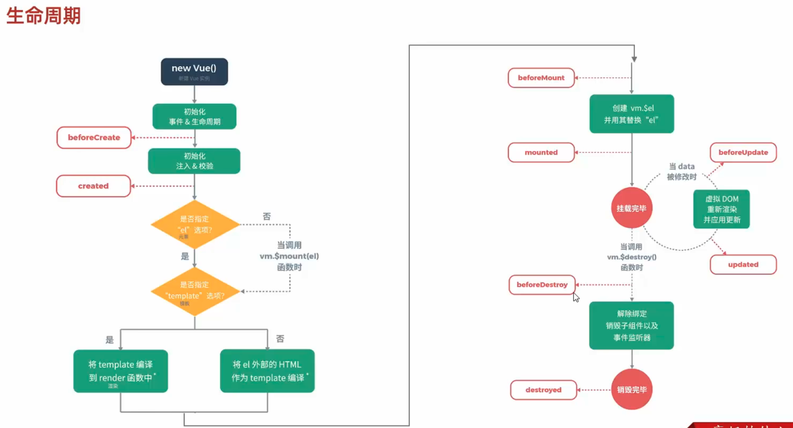

#### Axios
- 安装
  - <script src="https://cdn.jsdelivr.net/npm/axios/dist/axios.min.js"></script>
- 使用
  - `axios.get(url).then(response => {...})`
  - `axios.post(url, data).then(response => {...})`
  - `axios.put(url, data).then(response => {...})`
  - `axios.delete(url).then(response => {...})`

#### Maven
- 配置
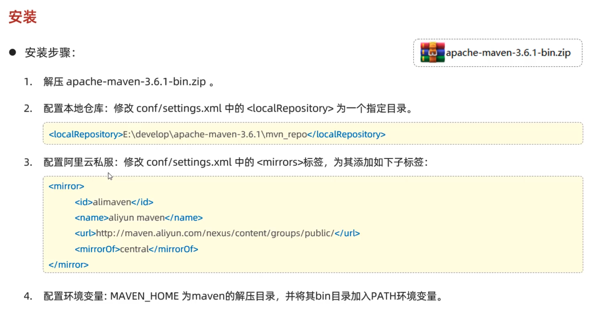
- 生命周期
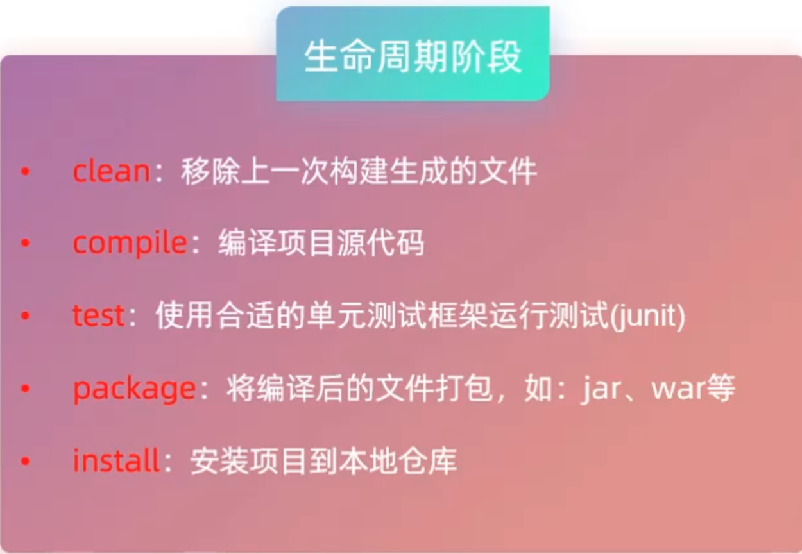

#### HTTP协议
- 特点：
  - 基于TCP/IP
  - 基于请求/响应模型
  - 无状态：每次请求都是独立的
- HTTP请求数据格式
  - 请求行：`GET /index.html HTTP/1.1`
  - 请求头：`Host: www.baidu.com`
  - 请求体：`username=admin&password=123456`
- HTTP响应数据格式
  - 状态行：`HTTP/1.1 200 OK`
    - 状态码
      - 1xx:信息
      - 2xx:成功
      - 3xx:重定向
      - 4xx:客户端错误
      - 5xx:服务器错误
  - 响应头：`Content-Type: text/html`
  - 响应体：`json数据`

#### 响应
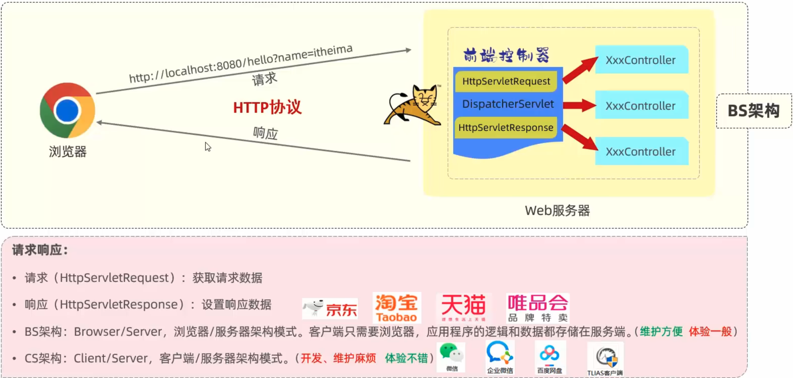
- 请求
  - 使用HttpServletRequest对象
    - `request.getParameter("name")`
    - `request.getParameterValues("name")`
    - `request.getParameterMap()`
    - `request.getAttribute("name")`
    - `request.getSession()`
    - `request.getServletContext()`
  - 使用StringBoot注解(或对照名称)
    - `@RequestParam`
    - `@PathVariable`
    - `@RequestBody`
    - `@RequestHeader`
    - `@CookieValue`
  - 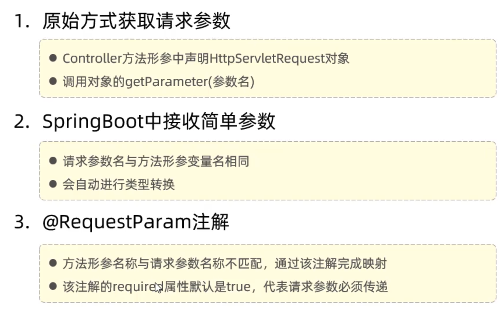
  - 简单参数
    - `@RequestParam("name") String name`
  - 实体参数
    - 使用POJO对象进行封装
  - 数组参数
    - 使用数组接收:`String[] names`
    - 使用List接收:`@RequestParm List<String> names`
  - 日期参数
    - 使用`@DateTimeFormat`
      - 注解：`@DateTimeFormat(pattern = "yyyy-MM-dd") LocalDateTime date`
  - Json参数
    - 使用`@RequestBody`封装实体类对象
      - 注解：`@RequestBody User user`
  - 路径参数
    - 使用`@PathVariable`注解
      - `@RequestMapping("/user/{id}")`
      - 注解：`@PathVariable("id") Long id`
- 解耦
  - 三层架构
    - Controller层:接收请求,调用Service层
    - Service层:处理业务逻辑,调用Dao层
    - Dao层:操作数据库
  - IOC (Inversion of Control) 控制反转
    - 控制权由程序员转交给Spring容器
    - `@Component, @Service, @Repository, @Controller`
  - DI (Dependency Injection) 依赖注入
    - 依赖关系由Spring容器注入
    - `@Autowired, @Resource, @Inject` (不推荐)
    - 构造函数注入, lombok注解: @RequiredArgsConstructor
  - 多重注解解决方案
    - `@Primary, @Qualifier, @Resource(name="..."), @Autowired(required=false)`

#### MyBatis
- 配置信息
  - 驱动类名称
  - `spring.datasource.driver-class-name=com.mysql.cj.jdbc.Driver`
  - 数据库连接的url
  - `spring.datasource.url=jdbc:mysql://localhost:3306/mybatis`
  - 连接数据库的用户名
  - `spring.datasource.username=root`
  - 连接数据库的密码
  - `spring.datasource.password=1234`
- 数据库连接池
  - hikari, druid
- 操作
  - 删除
    - `@Delete("delete from user where id = #{id}")`
  - 新增
    - `@Insert("insert into user values(#{id}, #{name}, #{password})")`
    - 主键返回
    - `@Options(useGeneratedKeys = true, keyProperty = "id")`
- 开启驼峰命名
  - `mybatis.configuration.map-underscore-to-camel-case=true`
- XML配置
  - 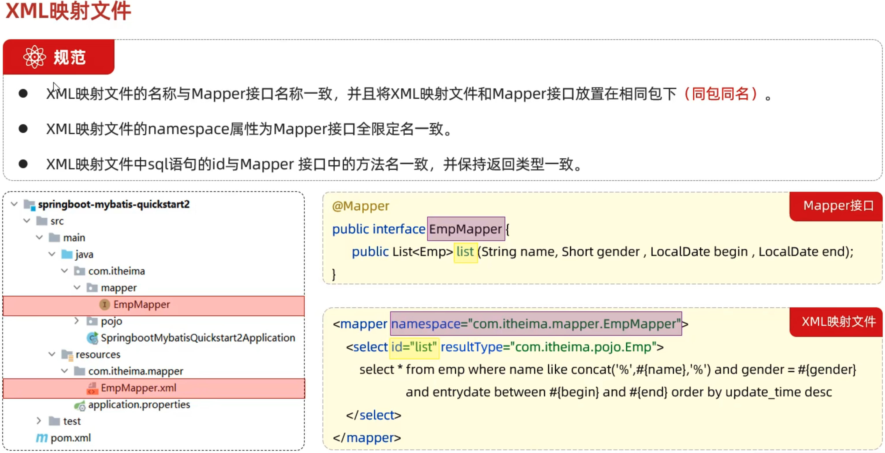
    - `<select id="list" resultType="kzhu.demo.pojo.User">`
- 动态SQL
  - if
    - ```<if test="name != null">`name=#{name},</if>```
  - where
    - ```<where>...</where>```
  - set
    - ```<set>...</set>```
  - foreach
    - ```<foreach collection="list" item="item" open="(" close=")" separator=",">#{item}</foreach>```
  - sql和include
    - ```<sql id="columns">...</sql>```
    - ```<include refid="columns"/>```

#### lombok
- @getter, @setter
- @ToString
- @EqualsAndHashCode
- @Data
- @NoArgsConstructor, @AllArgsConstructor

#### 文件上传
- 上传文件
  - `@RequestParam("file") MultipartFile file`
- 保存文件
  - `file.transferTo(new File("path"))`
- 设置文件大小
  - `spring.servlet.multipart.max-file-size=10MB`
- 设置文件名
  - `spring.servlet.multipart.file-name-uuid=true`
- 设置上传大小
  - `spring.servlet.multipart.max-request-size=100MB`

#### YML代替properties
- 优点
  - 层级结构
  - 冒号后面有空格
  - 支持多种数据类型
- @Value注解
  - `@Value("${name}")`
- @ConfigurationProperties注解 推荐
  - `@ConfigurationProperties(prefix = "person")`
  - `@Component`

#### 登录校验
- 登录标记
  - 会话技术
    - 会话：一次会话从打开浏览器到关闭浏览器
    - 会话跟踪：保持会话状态
      - 客户端会话跟踪技术：cookie
        - 优点：http协议支持
        - 缺点：移动端不支持，不安全用户可禁用，不支持跨域
      - 服务器端会话跟踪技术：session
        - 优点：安全，支持跨域
        - 缺点：
      - 令牌技术
        - JWT（JSON Web Token）
        - 第一部分：头部，记录类型和加密算法进行base64编码
        - 第二部分：载荷，记录用户信息进行base64编码
        - 第三部分：签名，对前两部分进行加密
        - 使用：
          - 引入依赖：jjwt，io.jsonwebtoken
          - 构建
          - 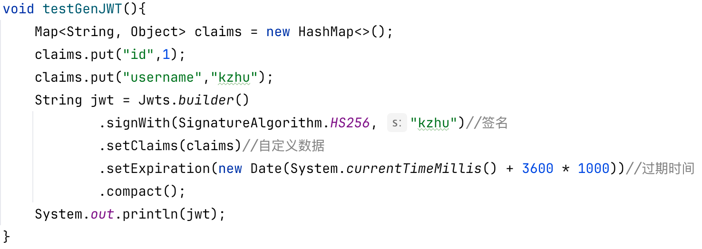
- 统一拦截
  - 过滤器：filter
    - 可以把对资源的请求拦截下来，进行一些处理
    - 定义filter: 定义一个类，实现Filter接口，重写所有方法（init, doFilter, destroy）
    - 配置filter: @WebFilter(urlPatterns = "/*")，启动类上加@ServletComponentScan
    - chain.doFilter(request, response)//放行
  - 拦截器：interceptor
    - 动态拦截方法调用的机制
    - 定义interceptor：定义一个类，实现HandlerInterceptor接口，重写所有方法（preHandle, postHandle, afterCompletion）
    - 定义配置拦截器：定义一个类，实现WebMvcConfigurer接口，重写addInterceptors方法，加上@Configuration注解（spring中的配置类）

#### Spring事务
- 开始事务注解：`@Transactional`
- 事务管理日志yml配置
  - `logging.level.org.springframework.jdbc.support.JdbcTransactionManager:debug`
- RollbackFor
  - `@Transactional(rollbackFor = Exception.class)`来指定回滚的异常，默认是运行时异常
- Propagation
  - `@Transactional(propagation = Propagation.REQUIRED)`来指定事务的传播行为
    - REQUIRED: 支持当前事务，如果不存在则创建新事务
    - REQUIRES_NEW: 创建新事务，如果存在则挂起当前事务

#### AOP(Aspect Oriented Programming) 面向切面编程
- 倒入依赖：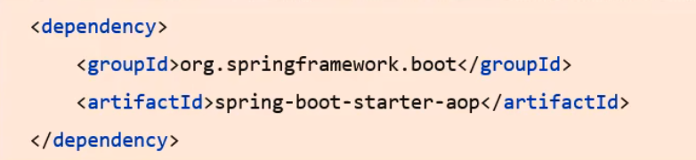
- 切入点表达式抽象案例：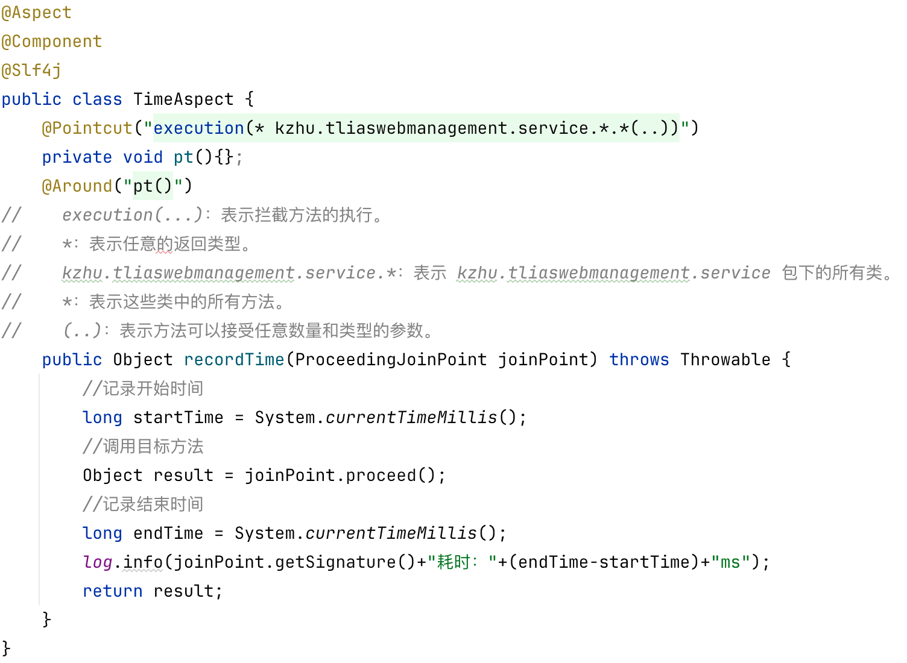
- 切入点表达式：
  - Execution：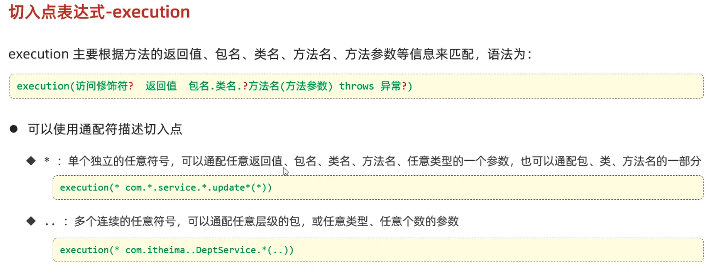
  - Annotation（使用自定义标记）：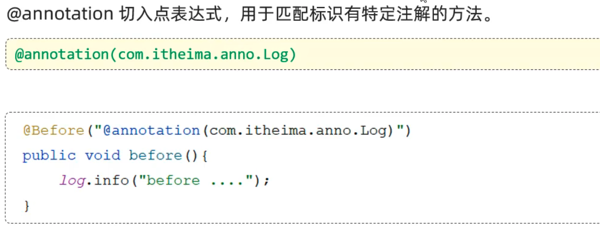

#### SpringBoot知识点
- 配置优先级：1：properties 2：yml 3：yaml
- java系统属性：-Dname=value
- 命令行参数：--name=value
  - 命令行参数大于java系统属性
- 打包执行命令行：java -jar xxx.jar --name=value
- 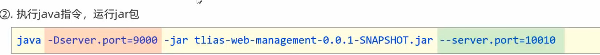
- **获取Bean**
  - 根据name获取bean：`Object getBean(String name)`
  - 根据类型获取bean：`<T> T getBean(Class<T> requiredType)`
  - 根据name和类型获取bean：`<T> T getBean(String name, Class<T> requiredType)`
  - 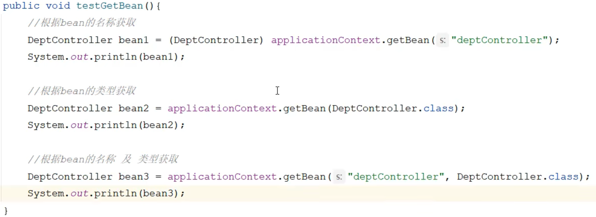
- **Bean的作用域(通过scope设置作用域)**
  - singleton：单例(默认)
  - prototype：多例
  - 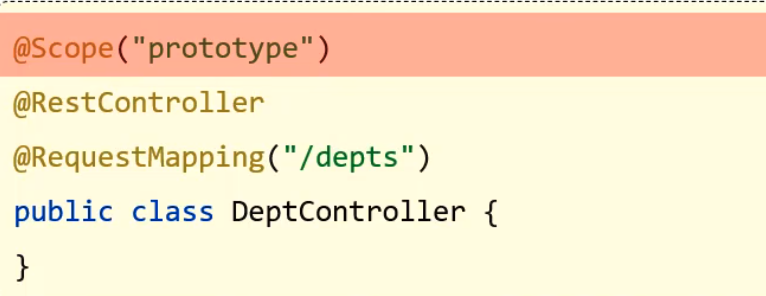
  - 在开始的时候就创建bean：可以用`@Lazy`注解，表示懒加载，只有在第一次使用的时候才会创建。