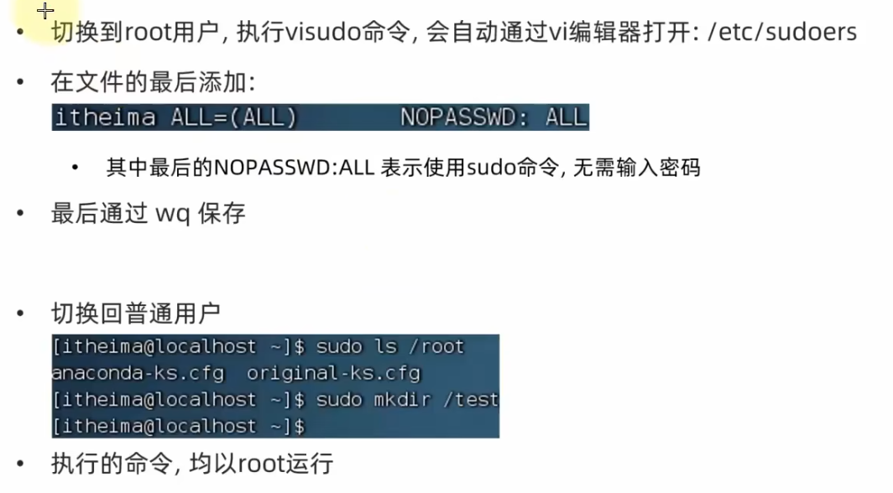

#### Linux notes总结
- **配置**
  - 账户全名：keweizhuazuki
  - 用户名：keweizhuazuki
  - 密码：123456
- **命令**
  - ifconfig: 查看网络信息
    - 192.168.200.101
  - ls: 查看文件
    - -a: 显示所有文件(包括隐藏文件)
    - -l: 显示详细信息(包括权限、所有者、大小、时间等)
    - -lh：显示详细信息(包括权限、所有者、大小、时间等),并且文件大小以KB、MB、GB等单位显示
    - -al/-la/-l -a: 同时使用多个参数,结合-a和-l
  - cd：切换目录 （change directory）
    - cd /: 切换到根目录
    - cd ..: 切换到上一级目录
    - cd ~: 切换到当前用户的home目录
  - pwd: 显示当前目录 (print working directory)
  - mkdir [-p]: 创建目录 (make directory)
    - -p: 递归创建目录
  - touch: 创建文件
  - cat: 查看文件内容 
  - more: 分页显示文件内容
    - 空格: 显示下一页
    - q: 退出
  - cp [-r] [参数1] [参数2]: 复制文件
    - -r: 复制文件夹使用，表示递归复制
  - cp [参数1] [参数2]: 复制文件
    - 参数1: 源文件 
    - 参数2: 目标地址
  - rm [-r -f] [文件名]: 删除文件
    - -r: 删除文件夹
    - -f: 强制删除
      - **su -root: 切换到root用户**
      - 通过exit退出root用户
    - 支持通配符 *
  - which: 查找命令的路径
  - find: 查找文件
    - find 起始路径 -name 文件名 ：根据文件名查找文件
    - find 起始路径 -size +/-(大小k/M/G) ：根据文件大小查找文件
      - +: 大于
      - -: 小于
  - grep [-n] 关键词 文件路径：查找文件中的关键词
    - -n: 显示行号
  - wc [-c -m -l -w] 文件路径：统计文件的字符数、字数、行数
    - -c: 字节数
    - -m: 字符数
    - -l: 行数
    - -w: 单词数
  - 管道符 |: 将一个命令的输出作为另一个命令的输入
  - echo 输出的内容: 输出
  - 反引号``: 执行命令
    - echo `pwd`
  - 重定向符号 
    - >: 将命令的输出重定向到文件（覆盖）
    - >>: 将命令的输出重定向到文件（追加）
  - tail [-f -num] 文件路径：查看文件的末尾内容
    - -f: 表示持续跟踪文件的内容
    - -num: 查看文件的最后num行
  - vim: 编辑器
    - i: 进入编辑模式
    - esc: 退出编辑模式
    - :wq: 保存并退出
    - :q!: 不保存退出
    - :set nu: 显示行号
    - :set nonu: 不显示行号
    - :set paste: 粘贴模式
    - dd: 删除一行
    - ndd: 删除n行
    - yy: 复制一行
    - nyy: 复制n行
    - p: 粘贴
    - u: 撤销

- **文件权限**
  - root用户
    - su - root: 切换到root用户
    - 通过exit退出root用户或者ctrl+d
  - 权限授予
    - sudo: 临时授权
    - 
- **用户和用户组**
  - groupadd: 创建用户组
  - groupdel: 删除用户组
  - useradd: 创建用户
    - -g: 指定用户组
    - -d: 指定用户目录
  - userdel: 删除用户
    - -r: 删除用户目录
  - id: 查看用户信息
  - usermod -aG 组名 用户名: 将用户添加到用户组
  - getent passwd: 查看所有用户
  - getent group: 查看所有用户组
- **文件权限** 
  - 
  - r: 读权限
  - w: 写权限
  - x: 执行权限
- **chmod**
  - chmod [-R] 权限 文件名: 递归修改文件权限
    - u: 用户
    - g: 用户组
    - o: 其他用户