#### MyBatisPlus
- **入门步骤**
  - 引入依赖：`mybatis-plus-boot-starter`
  - 自定义Mapper接口继承BaseMapper接口
- **常见注解**
  - 约定优于配置
    - 约定：
      - 类名驼峰转下划线为表名
      - 名为id的字段为主键
      - 变量名驼峰转下划线为字段名
    - 配置：
      - @TableName
      - @TableId(value = "xx", type = )
        - Type: AUTO, INPUT, ASSIGN_ID
      - @TableField
        - 成员变量是boolean类型时，字段名为is_xxx需要加上value属性
        - 成员变量与数据库关键词冲突时，字段名需要加上引号属性
        - 成员变量不是数据库字段时，字段名需要加上exist属性：exist = false
- **常见配置**
  - typeAliasesPackage: 实体类包名
  - mapperLocations: mapper.xml文件路径
  - congiguration.mapUnderscoreToCamelCase: 是否开启驼峰命名
  - configuration.cacheEnabled: 是否开启缓存
  - global-config.id-type: 主键策略
  - update-strategy: not_null 更新策略
- **条件构造器**
  - mp支持复杂的where条件
  - 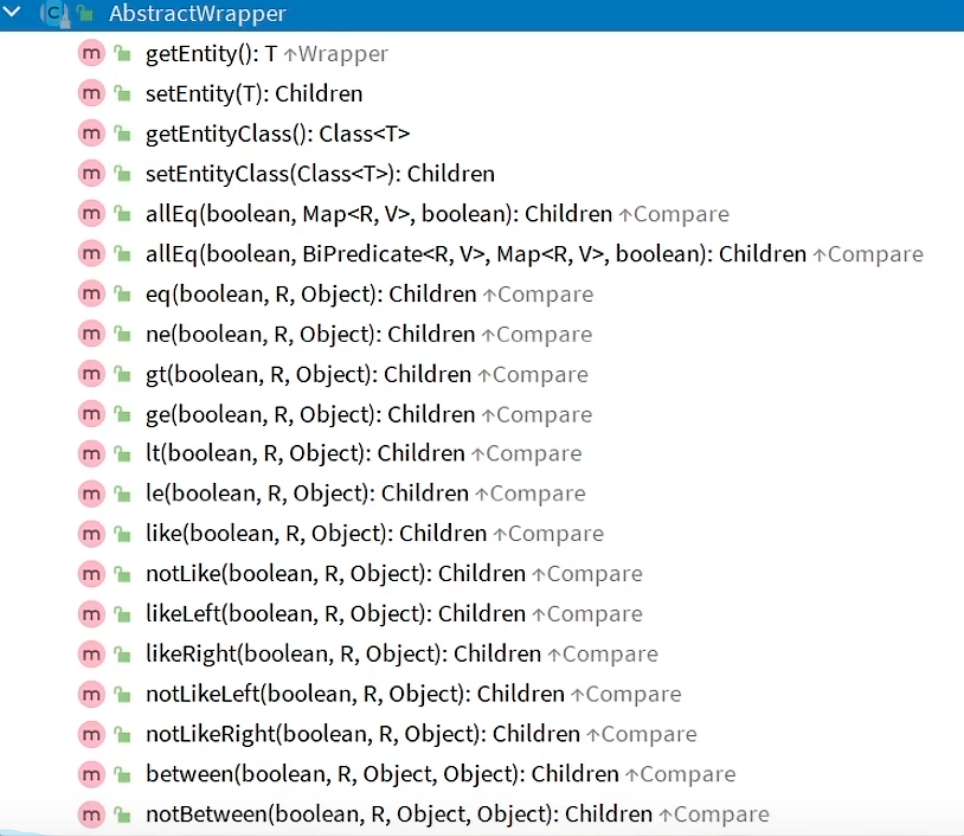
  - QueryWrapper/LambdaQueryWrapper来构建Select,Update,Delete,Where条件
    - 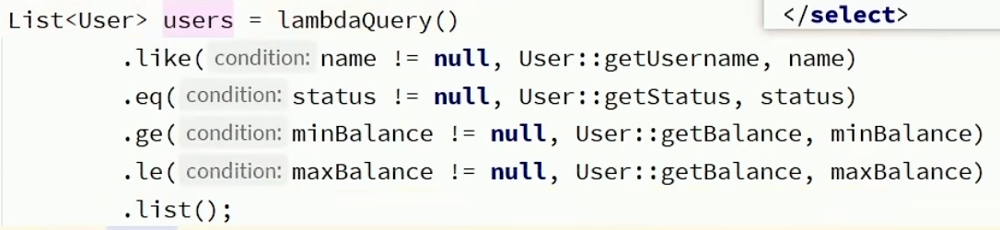
  - UpdateWrapper/LambdaUpdateWrapper来构建Update条件
    - 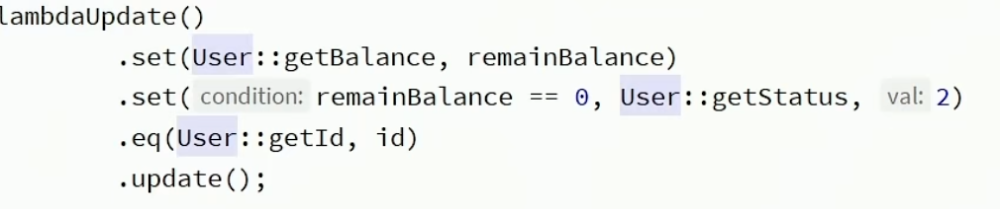
- **自定义sql**
  - 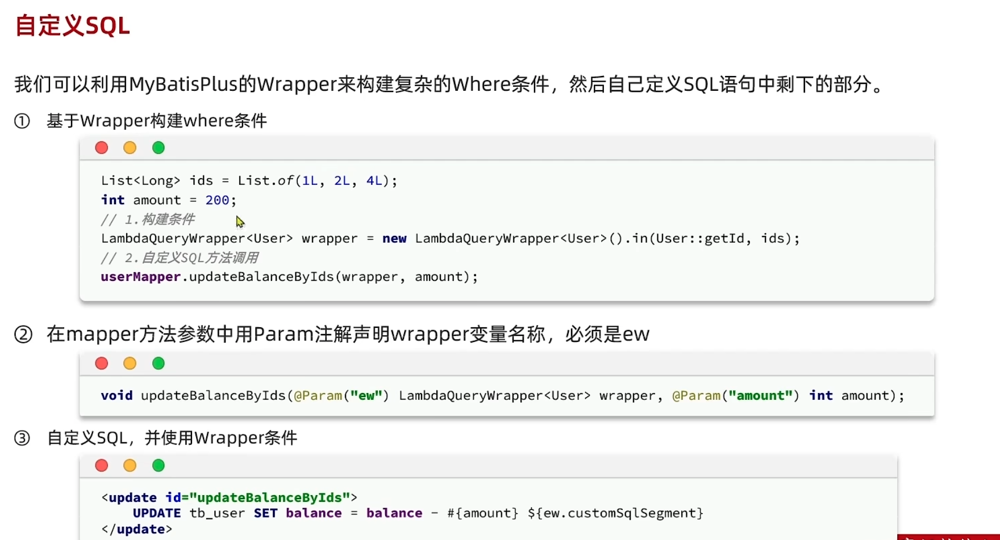
- **IService接口基本用法**
  - 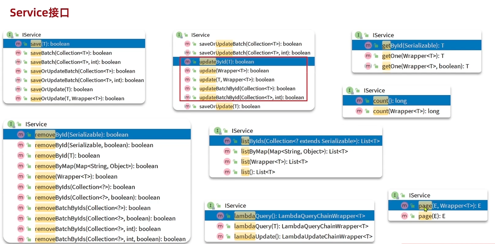

- **拓展功能**
  - 代码生成器
    - 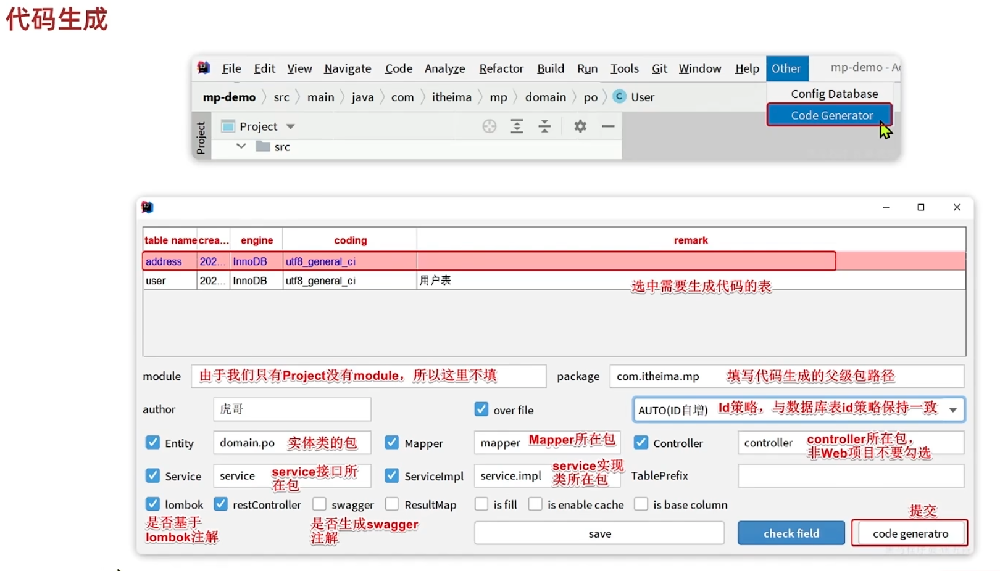
  - DB静态工具：**解决循环依赖问题**
    - 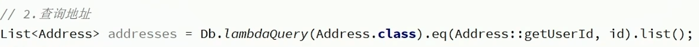
  - 逻辑删除：模拟删除效果
    - 在表中添加一个字段，用于标记是否删除
    - 查询时，只查询未标记删除的数据
    - 逻辑删除使用update语句
    - 配置：
      - 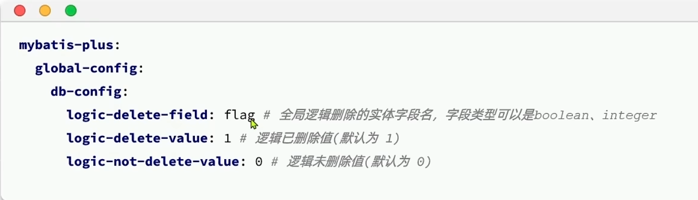
  - 枚举处理器
    - 枚举类的字段上加上注解：@EnumValue
    - 在application.yml中配置枚举处理器
      - 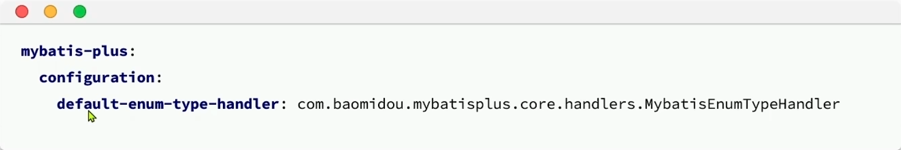
  - JSON处理器
    - 数据库字段为json格式时，需要加上注解：@TableField(typeHandler = JacksonTypeHandler.class)
    - TableField中的autoResultMap属性设置为true
    - 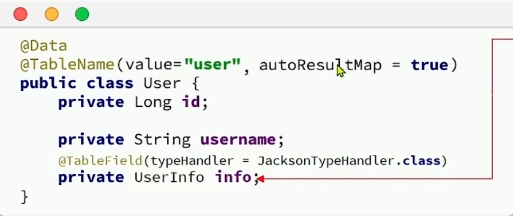
  - 分页插件
    - 配置类注册分页插件
      - 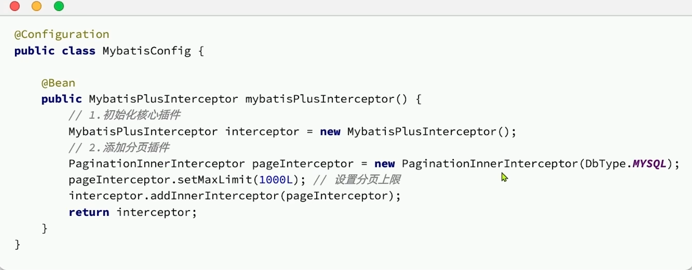
    - 使用page
      - 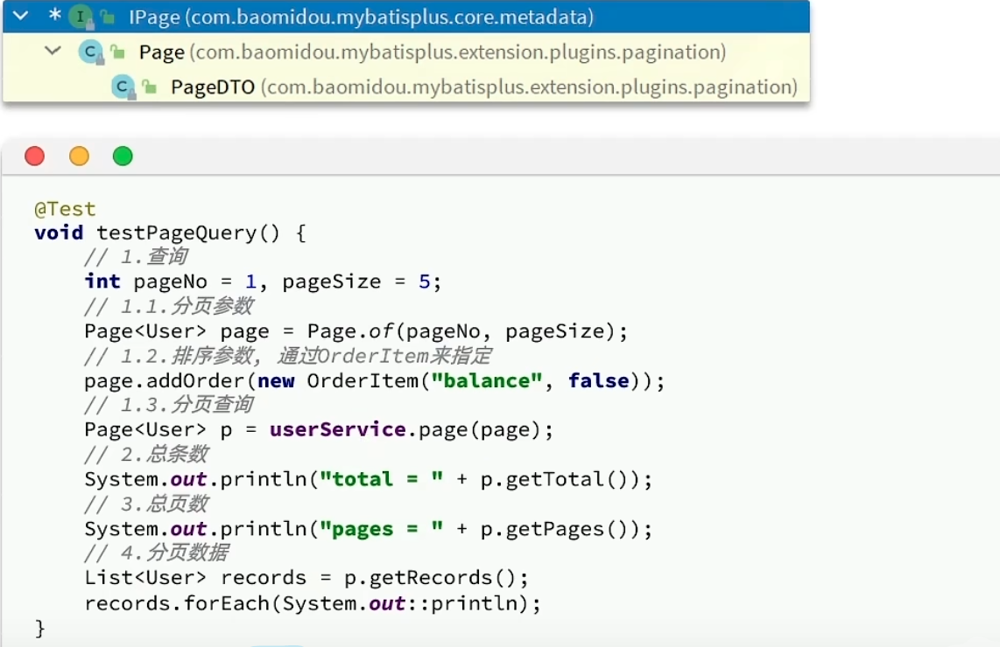