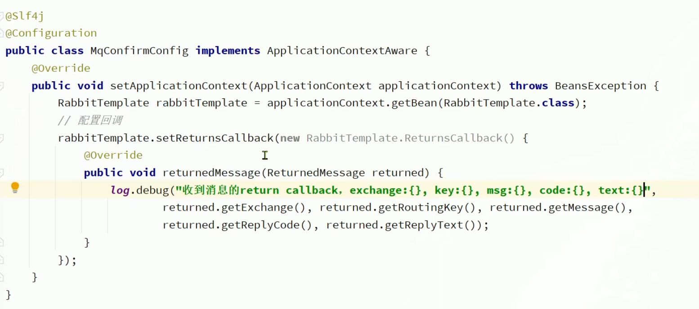
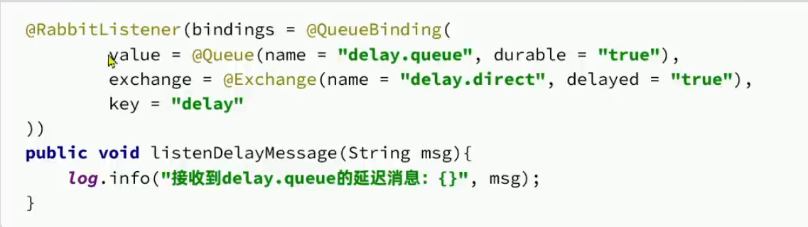

#### RabbitMQ
- 整体架构：
  - publisher: 消息发送者
  - consumer: 消息消费者
  - queue: 消息队列
  - exchange: 交换机
  - 
- 交换机**没有存储消息的能力**，只能将消息转发到队列
- 数据隔离：
  - vhost: 虚拟主机，类似于namespace
  - 不同的vhost之间的数据是隔离的
- java客户端：使用封装好的**Spring AMQP**
  - 配置：
    - 
  - 发送消息：使用rabbitTemplate
    - 
  - 接受消息：加上@RabbitListener注解
    - 
  - **消费者消息推送限制**：默认情况下，RabbitMQ会江消息依次轮询投递给绑定在队列上的每一个消费者，但这并没有考虑到消费者是否已经处理完消息，可能出现消息堆积。
    - 修改配置：
      - spring.rabbitmq.listener.simple.prefetch=1 : 每次只能获取一条消息
  - **交换机**
    - Fanout交换机：广播模式
      - 会将消息发送到所有绑定的队列
      - 不需要routingKey，只需要绑定交换机
    - Direct交换机：定向模式
      - 需要在客户端设置routingKey，只有routingKey和消息的routingKey一致才会发送到队列
    - Topic交换机：话题模式
      - routingKey支持通配符，routingKey可以是多个单词的列表，并且以.分割
      - *：匹配一个单词
      - #：匹配多个单词
      - ex: china.#：匹配china.开头的所有routingKey
      - ex: china.*：匹配china.后面只有一个单词的routingKey
  - java客户端声明交换机：
    - SpringAMQP提供了几个类，可以用来声明交换机、队列、绑定关系
      - Queue：声明队列，可以用工厂类QueueBuilder创建
      - Exchange：声明交换机，可以用工厂类ExchangeBuilder创建
        - 
      - Binding：声明绑定关系，可以用工厂类BindingBuilder创建
      - 绑定：
        - 第一种方式
        - 
        - 第二种方式（创建+绑定）
        - 
  - 消息转换器
    - 默认情况下，消息是以字节数组的形式发送的，发送对象会变成字节码，但是我们可以使用消息转换器将消息转换为我们需要的类型
    - 引入依赖
      - 
    - 在publisher和consumer中配置消息转换器：因为Jackson2JsonMessageConverter是默认的消息转换器，所以我们只需要在配置文件中配置即可
      - 
- 消息可靠性问题
  - **发送者的可靠性**
    - 生产者重连
      - 有的时候由于网络波动，可能会出现客户端连接mq失败，通过配置可以开启失败后的重连机制
      - 
    - 生产者确认
      - 使用Publisher Confirm和Publisher Return机制。开启确认机制后，在MQ成功收到的消息后会返回确认消息给生产者。返回的结果有以下几种情况：
        - 当消息投递到MQ，但是路由失败时，通过Publisher Return返回异常信息，同时返回ack的确认信息，代表投递成功
        - 临时消息投递到了MQ，并且入队成功，返回ACK，告知投递成功
        - 持久消息投递到了MQ，并且入队完成持久化，返回ACK ，告知投递成功
        - 其它情况都会返回NACK，告知投递失败
      - 生产者确认配置：
        -  在publisher配置文件中配置
        -  
        - none：关闭confirm机制
        - simple：同步阻塞等待MQ的回执
        - correlated：MQ异步回调返回回执
        - 需要**在生产者中添加回调函数**
        - 
        - 确认回调函数
        - 
  - **MQ的可靠性**
    - 默认情况，RabbitMQ会将接收到的消息存储在内存中，如果MQ宕机或者内存空间不足，消息会丢失
    - **数据持久化：**
      - 交换机持久化：重启后交换机还在
      - 队列持久化：重启后队列还在
      - 数据持久化：
        - 在发送消息时，控制台会有一个deliveryMode参数，可以设置为2，表示消息持久化
        - java默认是持久化的但是性能会有所下降
      - Lazy Queue：懒惰队列
        - 在队列中设置x-queue-mode为lazy，可以将消息存储在磁盘中，减少内存的使用
        - 3.12.0版本之前
          - 
        - 3.12.0版本之后默认
  - **消费者的可靠性**
    - 消费者确认机制
      - ack: 成功处理消息，RabbitMQ会删除消息
      - nack: 失败消息，RabbitMQ会重新投递消息
      - reject: 拒绝消息，RabbitMQ会删除消息
      - SpringAMQP已经实现了消息确认功能。并允许我们通过配置文件选择ACK处理方式，有三种方式：
        - **AUTO**：自动确认，消息一旦被接收，根据异常判断返回ACK或NACK
        - MANUAL：手动确认，消费者手动确认
        - NONE：不处理，消息投递给消费者后立刻ACK，消息立刻从MQ中删除
        - 
    - 消费者失败处理
      - 当消费者出现异常后，消息会不断requeue到队列，无限循环。
      - 可以利用spring的retry机制，在消费者出现异常时利用本地重试，而不是无限制的requeue到mq队列
      - 
      - 开启重试模式后，如果消息依然失败，则需要有MessageRecover接口来处理，有三种实现方式：
        - RejectAndDontRequeueRecoverer：拒绝消息，不重新入队
        - ImmediateRequeueMessageRecoverer：返回nack，立即重新入队
        - RepublishMessageRecoverer：将失败消息投递到指定的交换机
          - 自定义一个error交换机，将失败消息投递到error交换机
          - 定义RepublishMessageRecoverer
          - 
          - error.direct为交换机，error为routingKey
          - 加上`@ConditionalOnProperty(name = "spring.rabbitmq.listener.simple.retry.enabled", havingValue = "true")`注解，表示只有在开启重试模式时才会生效
    - 业务幂等性
      - 保证消息处理的幂等性，即使消息重复消费也不会对业务产生影响
      - 通过消息的唯一标识来保证消息的幂等性
      - **方案1：唯一消息ID**
        - 每一条消息都生成一个唯一的id，与消息一起投递给消费者。
        - 消费者接收到消息后处理自己的业务，业务处理成功后将消息ID保存到数据库
        - 如果下次又收到相同消息，去数据库查询判断是否存在，存在则为重复消息放弃处理。
        - 
      - **方案2：业务判断**
        - 
  - 延迟消息
    - 生产者发送消息时指定一个时间，消费者不会立刻受到消息，而是在指定时间后才会收到消息
    - 死信交换机
      - 当一个队列中的消息满足下列情况之一时，可以成为死信（dead letter）：
        - 消费者使用basic.reject或 basic.nack声明消费失败，并且消息的requeue参数设置为false
        - 消息是一个过期消息，超时无人消费
        - 要投递的队列消息满了，无法投递
      - 如果一个队列中的消息已经成为死信，并且这个队列通过dead-letter-exchange属性指定了一个交换机，那么队列中的死信就会投递到这个交换机中，而这个交换机就称为死信交换机（Dead Letter Exchange）。而此时加入有队列与死信交换机绑定，则最终死信就会被投递到这个队列中。
      - 控制台发消息可以在header中这只expiration属性
      - 使用java代码
        - 
      - 
      - 在使用Jackson2JsonMessageConverter时，需要使用后置处理器来设置消息的过期时间
    - 延迟消息插件
      - RabbitMQ的官方也推出了一个插件，原生支持下延迟消息功能。该插件的原理是设计了一种支持延迟消息功能的交换机，当消息投递到交换机后可以暂存一定时间，到期后再投递到队列中。
      - 下载并且开启插件：rabbitmq_delayed_message_exchange
      - 使用bean创建交换机
        - 
      - 在交换机配置中设置delayed=“true”
        - 
      - 发送消息时候需要通过消息头x-delay来设置过期时间
        - 
    - 取消超时订单
      - 
#### 面试
