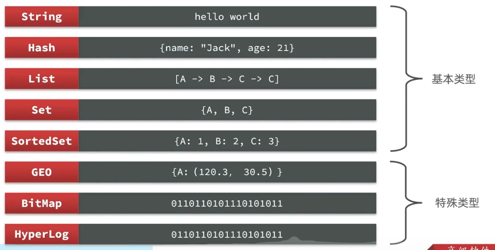
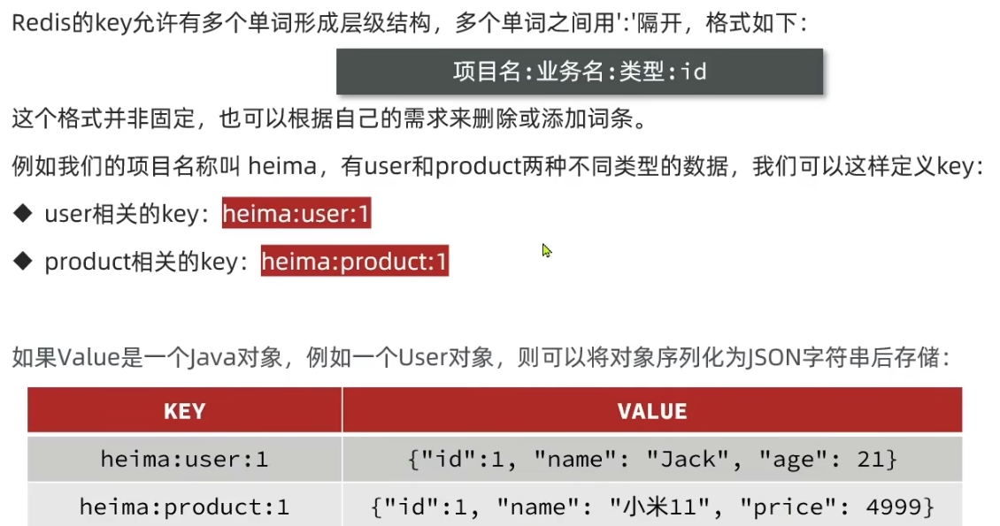
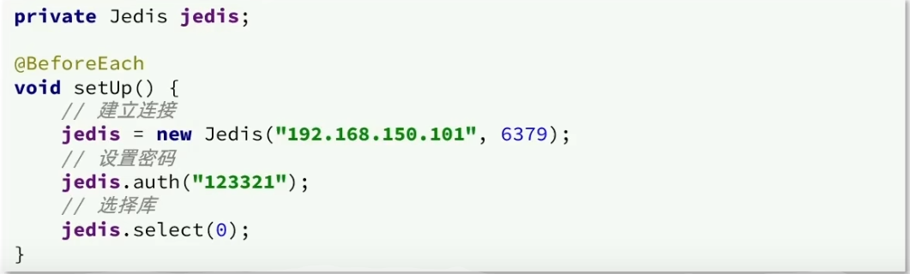
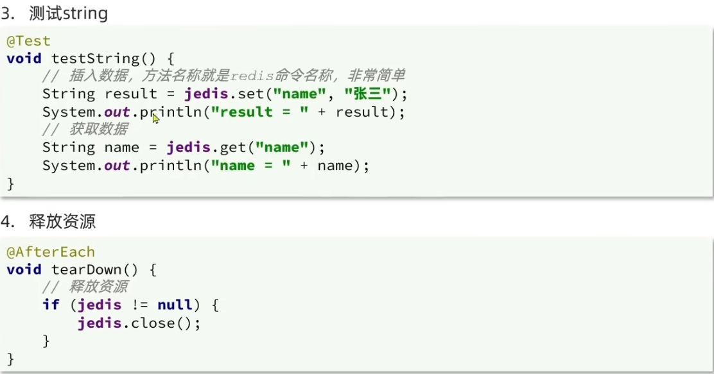
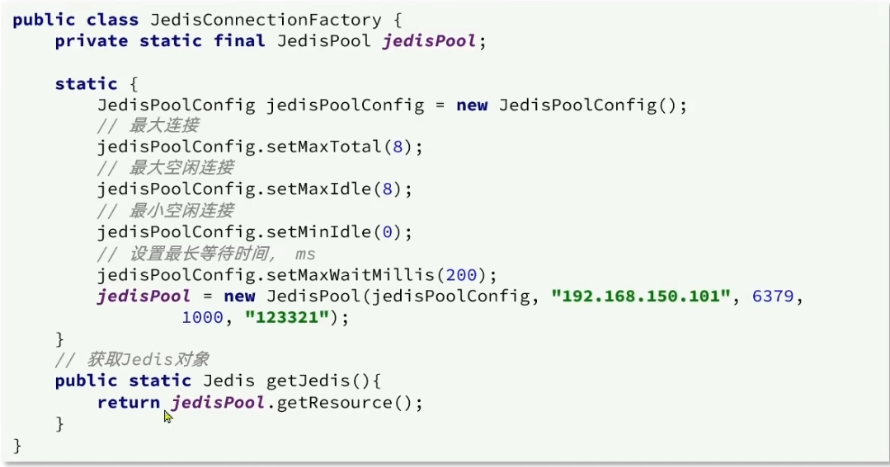
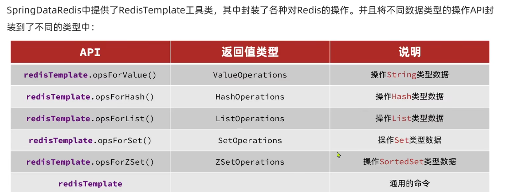
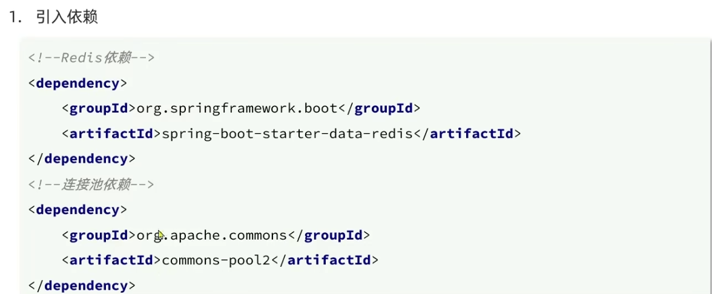
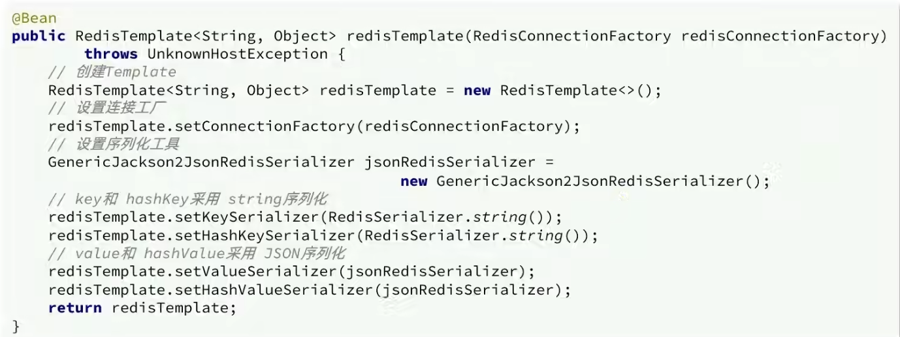
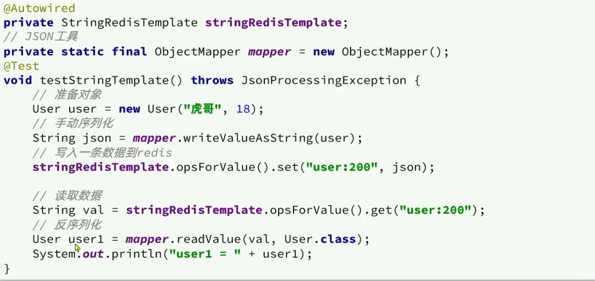
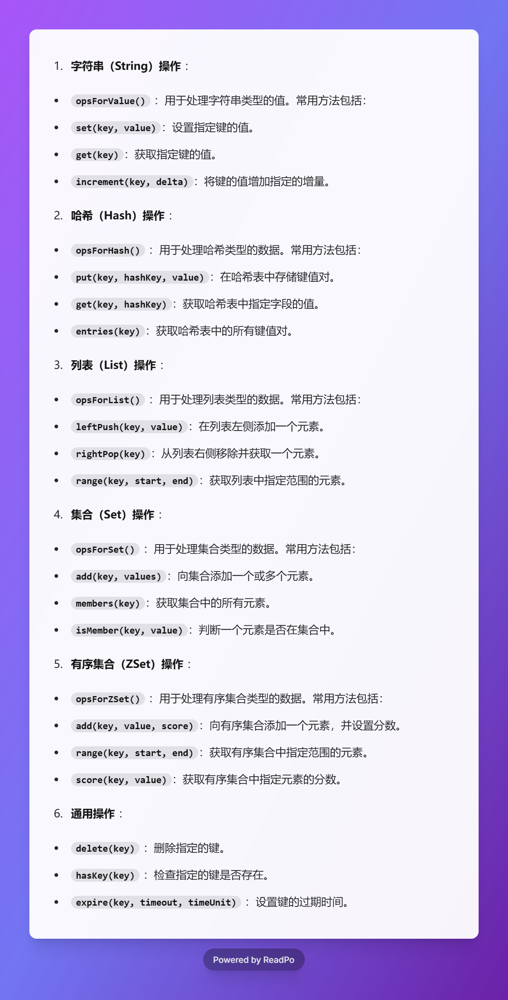

#### 初识Redis
- 下载：https://redis.com.cn/
- 上传到服务器，解压，make&&make install
- **修改配置文件（redis.conf），启动服务**
  - bind 0.0.0.0: 允许所有IP访问
  - daemonize yes: 后台运行
  - requirepass 123456: 设置123456为密码
  - dir .: 设置数据文件存储目录
  - databases 1: 设置数据库数量
  - maxmemory 100mb: 设置最大内存
  - logfile redis.log: 设置日志文件
- 启动服务：redis-server redis.conf
- 关闭服务：redis-cli -a 123456 shutdown
-**Redis命令行客户端：**
  - redis-cli [options][commands]
    - -h 127.0.0.1: 指定主机
    - -p 6379: 指定端口
    - -a 123456: 指定密码 或者 先连接再使用auth 123456
- **Redis图形化客户端：**
  - github：https://github.com/lework/RedisDesktopManager-Windows/releases
  - 虚拟机需要关闭防火墙：systemctl stop firewalld
#### Redis常见命令
- **数据结构**
  - 
- **常见命令**
  - https://redis.com.cn/tutorial.html
  - 通用命令
    - KYES pattern: 查看所有key
      -  - KEYS *: 查看所有key
      -  - KEYS user*: 查看所有以user开头的key
   -  DEL key: 删除key
   -  EXISTS key: 判断key是否存在
   -  EXPIRE key seconds: 设置key的过期时间
      - TTL key: 查看key的剩余时间
  - 字符串
    - SET key value: 设置key的值
    - GET key: 获取key的值
    - MSET key value [key value ...]: 批量设置key的值
    - MGET key [key ...]: 批量获取key的值
    - INCR key: key的值加1
    - INCRYBY key: key的值加指定值
    - INCRYBYFLOAT key: key的值加指定浮点数
    - SETNX key value: 只有key不存在时才设置key的值
    - SETEX key seconds value: 设置key的值和过期时间
  - key的结构
    - 
  - Hash类型
    - HSET key field value: 设置hash的值
    - HGET key field: 获取hash的值
    - HMSET key field value [field value ...]: 批量设置hash的值
    - HMGET key field [field ...]: 批量获取hash的值
    - HGETALL key: 获取hash的所有值
    - HKEYS key: 获取hash的所有field
    - HVALS key: 获取hash的所有value
    - HINCRYBY key field increment: hash的值加指定值
    - HSETNX key field value: 只有hash的field不存在时才设置hash的值
  - List类型
    - LPUSH key value [value ...]: 在list的头部插入值
    - LPOP key: 移除并返回list的头部元素
    - RPUSH key value [value ...]: 在list的尾部插入值
    - RPOP key: 移除并返回list的尾部元素
    - LRANGE key start stop: 获取list的指定范围的元素
    - BLOPOP key timeout: 阻塞式地移除并返回list的头部元素
    - BRPOP key timeout: 阻塞式地移除并返回list的尾部元素
  - Set类型
    - SADD key member [member ...]: 向set中添加元素
    - SMEMBERS key: 获取set的所有元素
    - SISMEMBER key member: 判断元素是否在set中
    - SREM key member [member ...]: 移除set中的元素
    - SCARD key: 获取set的元素个数
    - SINTER key [key ...]: 求交集
    - SDIFF key [key ...]: 求差集
    - SUNION key [key ...]: 求并集
  - SortedSet
    - ZADD key score member [score member ...]: 向sorted set中添加元素
    - ZREM key member [member ...]: 移除sorted set中的元素
    - ZSCORE key member: 获取元素的分数
    - ZRANK key member: 获取元素的排名
      - - ZREVRANK key member: 获取元素的排名（降序）
    - ZCARD key: 获取sorted set的元素个数
    - ZCOUNT key min max: 获取指定分数范围内的元素个数
    - ZINCRYBY key increment member: 增加元素的分数
    - ZRANGE key min max: 获取指定排名范围内的元素
    - ZRANGEBYSCORE key min max: 获取指定分数范围内的元素
    - ZDIFF,ZINTER,ZUNION: 分别求差集、交集、并集
#### Redis的Java客户端
- **Jedis**
  -引入依赖
    - ```xml
      <dependency>
          <groupId>redis.clients</groupId>
          <artifactId>jedis</artifactId>
          <version>3.7.0</version>
      </dependency>
      ```
  - 建立连接
    - 
  - 测试
    - 
  - jedis需要配合连接池使用
    - 
- **Spring Data Redis**
  - 
  - 使用Spring-boot框架
    - 引入依赖
      - 
    - 配置地址信息
    - 自定义RedisTemplate（可选）
      - 
  - 为了节省空间，我们不会使用JSON序列化处理器来处理value，而是统一使用String序列化器，要求只能存储String类型的key和value，当需要存储java对象时，手动完成对象的序列化和反序列化
    - 使用StringRedisTemplate搭配json序列化工具：ObjectMapper
    - 
  - 