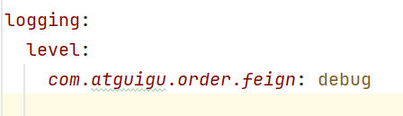

#### Spring Cloud
- 分布式微服务架构：
  - 服务注册与发现：
  - 
  - 当用户想要获取订单服务时，首先会通过服务注册中心获取服务的地址，然后通过负载均衡器选择一个服务节点进行访问。
  - 
- 环境准备
  - 
  - 
##### Nacos
- 架构：
  - 
- 下载：
  - https://nacos.io/download/release-history/?spm=5238cd80.c984973.0.0.6be14023VdL1Gl
  - 进入bin目录，执行命令：`startup.cmd -m standalone`：启动nacos单机模式
- 服务注册流程
  - 
- 服务发现：
  - 开启服务发现功能：`@EnableDiscoveryClient`
  - api：`DiscoveryClient`：所有服务发现都有的接口
  - api：`NacosServiceDiscovery`:只有nacos才有的服务发现
  - 
- 远程调用负载均衡
  - 引入负载均衡依赖：`spring-cloud-starter-loadbalancer`
  - api：`LoadBalancerClient`：所有负载均衡都有的接口
  - 方法：`choose(String serviceId)`：负载均衡地选择一个服务实例
  - 使用注解：`@LoadBalanced`：开启负载均衡标记在RestTemplate上
- 配置中心
  - 
  - 基本使用
    - 
    - `@Value(“${xx}”)` 获取配置 + `@RefreshScope` 实现自动刷新
    - `@ConfigurationProperties`无感自动刷新
    - 
    - 无需RefreshScope
  - NacosConfigManager监听配置变化：一旦配置发生变化，可以选择监听+通知
    - 
  - 面试题：Nacos中的数据集 和 application.properties 有相同的配置项，哪个生效？
    - 应该是Nacos中的数据集生效，因为Nacos中的数据集优先级更高
  - 数据隔离
    - 
    - 
    - 配置为namespace为dev，group为order的common.properties和database.properties
    - 
    - 不同环境的不同配置
- Nacos总结
  - 
##### OpenFeign
- 生成式REST客户端
- 注解驱动
  - 指定远程地址：`@FeignClient`
  - 指定请求方式：`@GetMapping`、`@PostMapping`、`@DeleteMapping`
  - 指定携带数据：`@RequestParam`、`@RequestBody``@RequesetBody`
  - 指定结果返回：响应模型
- 使用流程：
  - 引入依赖：`spring-cloud-starter-openfeign`
  - 开启feign远程调用：`@EnableFeignClients`
  - ex：
    - 
    - 任务逻辑：向server-product发起请求，请求路径为`/product/{id}`，id被当作pathVariable传递，把token放到header中,返回值为Product
- 远程调用 - 第三方API 例子
  - 
- 面试题：客户端负载均衡与服务端负载均衡的区别？
  - 客户端负载均衡：发起调用的一方根据负载均衡算法挑选一个服务节点进行调用，如ribbon
  - 服务端负载均衡：服务端（比如第三方）根据自身的负载情况，将请求分发到不同的服务节点
- 进阶用法：
  - 日志：如果想看到第三方服务的日志，可以在配置文件中配置日志级别
    - 
    - 容器配置组件
      - 
  - 超时控制：如果第三方服务响应时间过长，可以设置超时时间，避免堵塞，造成服务雪崩
    - 
    - connectTimeout：连接超时时间，默认：10s
    - readTimeout：读取超时时间，默认：60s
    - 
  - 重试机制：远程调用失败后，还可以进行多次尝试，如果多次依然失败，返回错误
    - 默认：不开启重试机制，但是有重试机制的配置
    - 
    - 指的是：第一次100ms，第二次是1.5倍，第三次是100*1.5*1.5。如果超过了maxPeriod，就按照maxPeriod来。最大重试次数是5次
    - 自定义比如**Logger.Level**,**Retryer**
      - 
      - default就是上面的配置
  - 拦截器：
    - 
    - 请求拦截器
    - 
    - 使用`@Component`注入IOC容器，Feign客户端会自动扫描到使用
  - Fallback，注意：需要搭配sentinel使用
    - 
    - 自定义fallback类，实现feign接口，重写方法，返回默认值
      - 
    - 在@FeignClient中指定fallback类
      - 
    - 导入依赖，配置文件开启sentinel
      - 
##### Sentinel
##### Gateway
##### Seata