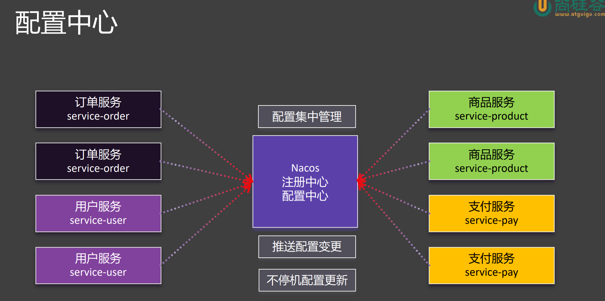
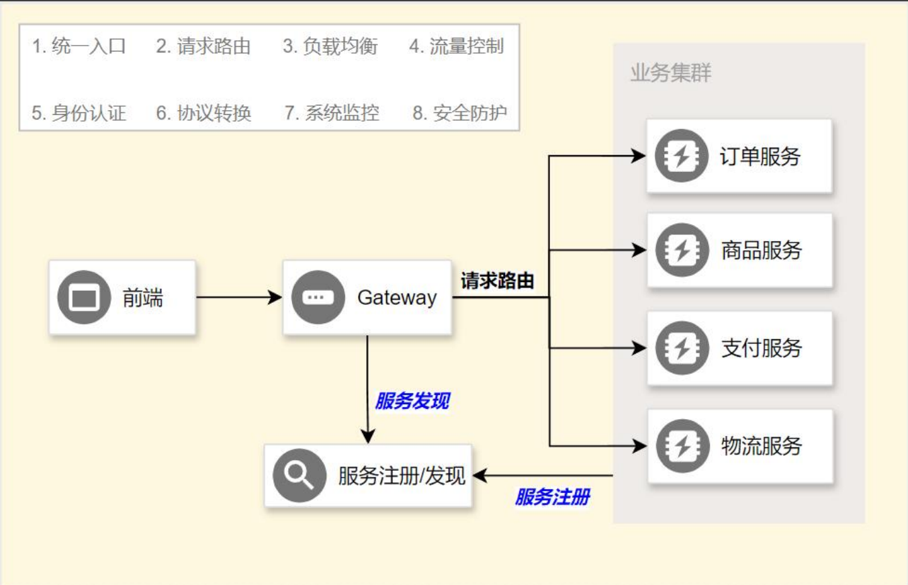

#### Spring Cloud
- 分布式微服务架构：
  - 服务注册与发现：
  - 
  - 当用户想要获取订单服务时，首先会通过服务注册中心获取服务的地址，然后通过负载均衡器选择一个服务节点进行访问。
  - 
- 环境准备
  - 
  - 
##### Nacos
- 架构：
  - 
- 下载：
  - https://nacos.io/download/release-history/?spm=5238cd80.c984973.0.0.6be14023VdL1Gl
  - 进入bin目录，执行命令：`startup.cmd -m standalone`：启动nacos单机模式
- 服务注册流程
  - 
- 服务发现：
  - 开启服务发现功能：`@EnableDiscoveryClient`
  - api：`DiscoveryClient`：所有服务发现都有的接口
  - api：`NacosServiceDiscovery`:只有nacos才有的服务发现
  - 
- 远程调用负载均衡
  - 引入负载均衡依赖：`spring-cloud-starter-loadbalancer`
  - api：`LoadBalancerClient`：所有负载均衡都有的接口
  - 方法：`choose(String serviceId)`：负载均衡地选择一个服务实例
  - 使用注解：`@LoadBalanced`：开启负载均衡标记在RestTemplate上
- 配置中心
  - 
  - 基本使用
    - 
    - `@Value(“${xx}”)` 获取配置 + `@RefreshScope` 实现自动刷新
    - `@ConfigurationProperties`无感自动刷新
    - 
    - 无需RefreshScope
  - NacosConfigManager监听配置变化：一旦配置发生变化，可以选择监听+通知
    - 
  - 面试题：Nacos中的数据集 和 application.properties 有相同的配置项，哪个生效？
    - 应该是Nacos中的数据集生效，因为Nacos中的数据集优先级更高
  - 数据隔离
    - 
    - 
    - 配置为namespace为dev，group为order的common.properties和database.properties
    - 
    - 不同环境的不同配置
- Nacos总结
  - 
##### OpenFeign
- 生成式REST客户端
- 注解驱动
  - 指定远程地址：`@FeignClient`
  - 指定请求方式：`@GetMapping`、`@PostMapping`、`@DeleteMapping`
  - 指定携带数据：`@RequestParam`、`@RequestBody``@RequesetBody`
  - 指定结果返回：响应模型
- 使用流程：
  - 引入依赖：`spring-cloud-starter-openfeign`
  - 开启feign远程调用：`@EnableFeignClients`
  - ex：
    - 
    - 任务逻辑：向server-product发起请求，请求路径为`/product/{id}`，id被当作pathVariable传递，把token放到header中,返回值为Product
- 远程调用 - 第三方API 例子
  - 
- 面试题：客户端负载均衡与服务端负载均衡的区别？
  - 客户端负载均衡：发起调用的一方根据负载均衡算法挑选一个服务节点进行调用，如ribbon
  - 服务端负载均衡：服务端（比如第三方）根据自身的负载情况，将请求分发到不同的服务节点
- 进阶用法：
  - 日志：如果想看到第三方服务的日志，可以在配置文件中配置日志级别
    - 
    - 容器配置组件
      - 
  - 超时控制：如果第三方服务响应时间过长，可以设置超时时间，避免堵塞，造成服务雪崩
    - 
    - connectTimeout：连接超时时间，默认：10s
    - readTimeout：读取超时时间，默认：60s
    - 
  - 重试机制：远程调用失败后，还可以进行多次尝试，如果多次依然失败，返回错误
    - 默认：不开启重试机制，但是有重试机制的配置
    - 
    - 指的是：第一次100ms，第二次是1.5倍，第三次是100*1.5*1.5。如果超过了maxPeriod，就按照maxPeriod来。最大重试次数是5次
    - 自定义比如**Logger.Level**,**Retryer**
      - 
      - default就是上面的配置
  - 拦截器：
    - 
    - 请求拦截器
    - 
    - 使用`@Component`注入IOC容器，Feign客户端会自动扫描到使用
  - Fallback，注意：需要搭配sentinel使用
    - 
    - 自定义fallback类，实现feign接口，重写方法，返回默认值
      - 
    - 在@FeignClient中指定fallback类
      - 
    - 导入依赖，配置文件开启sentinel
      - 
##### Sentinel
- 用于服务保护（限流、降级、熔断）
- 
- **定义资源：**
  - 主流框架自动实拍（Web Servlet, Dubbo, Spring Cloud, gRPC, Spring WebFlux, Reactor）所有web接口均为资源
  - 编程式：SphU API
  - 声明式：`@SentinelResource`
- **定义规则：**
  - 流量控制（FlowRule)
  - 熔断降级（DegradeRule)
  - 系统保护（SystemRule)
  - 来源访问控制（AuthorityRule)
  - 热点参数（ParamFlowRule)
- **原理：**
  - 
- **整合使用**
  - 
  - 1：sentinel默认账号密码：sentinel/sentinel
  - 2：
    - 配置依赖：`spring-cloud-starter-alibaba-sentinel`
    - 配置文件
      - 
- **异常处理**
  - 
  - 
  - 解决Web接口异常
    - 自定义BlockExceptionHandler放入IOC容器
    - 
  - 解决被`@SentinelResource`注解的方法异常
    - 需要标记blockHandler或者fallback属性，如果没有标记，会抛出异常
    - 创建同样的方法，返回值和参数一样，加上BlockException参数
    - 
  - 解决openfeign调用异常
    - 如果openfeign有兜底回调，那么sentinel会调用兜底回调
    - 如果没有会抛出springboot全局异常
  - 解决SphU硬编码异常
    - 使用try-catch捕获异常
- **流控规则**
  - 
  - 流控模式
    - 直接：超过阈值，直接拒绝
      - 
    - 关联：当关联的资源达到阈值，就限流自己
      - 
      - 
      - 当writeDb达到阈值，就限流readDb
    - 链路：只对指定链路限流
      - 关闭上下文统一：spring.cloud.sentinel.web-context-unify=false
      - 
      - 指的是：对createOrder资源进行限流，只针对/seckill路径，不针对其他路径
      - 
  - **tips：** 只有快速失败可以和关联、链路一起使用,warm up和排队等待只能和直接一起使用
- **流控效果**
  - 快速失败
    - 超出阈值，直接抛出异常
  - warm up
    - 阈值内，慢慢增加到阈值
    - 
    - 一开始处理阈值的1/3，然后慢慢增加到阈值
  - 排队等待
    - 
- **熔断规则**
  - 
  - 
  - 断路器的工作原理
    - 
  - 慢调用比例
    - 
    - 在5秒内，如果请求1秒钟还没有返回的比例超过80%，就熔断（打开断路器）30秒
  - 异常比例
    - 
    - 在5秒内，如果请求1秒钟异常比例超过80%，就熔断（打开断路器）30秒
  - 异常数
    - 
    - 在五秒内，如果异常数大于10，就熔断30秒
- **热点规则**
  - 
  - **注意：** 目前sentinel自带的adapter仅Dubbo方法埋点支持热点参数限流，其他模块（web）暂不支持，可通过自定义实现，但是自定义埋点的资源名不要与模块生成的资源名重复
  - 
  - 需求1：为第0个参数设置热点参数，阈值为1，如果不携带参数，则不生效
  - 需求2：给例外参数6设置为大阈值达到不限流的目的
    - 
  - 需求3：把666号商品设置为0阈值，达到不让访问的目的
    - 
  - 补充：sentinelresource处理异常规则：有blockHandler就走blockHandler，没有就走fallback
    - fallback好处：可以处理业务异常，blockHandler只能处理sentinel异常
    - 可以把方法签名改为Throwable而非BlockException，这样可以处理所有异常
    - 
##### Gateway
- 
- 两种网关
  - Reactive server：常用
    - 依赖：`spring-cloud-starter-gateway`
  - Server MVC：不常用
    - 依赖：`spring-cloud-starter-gateway-mvc`
- 需求：
  - 客户端发送`/api/order/**`转到service-order
  - 客户端发送`/api/product/**`转到service-product
  - 以上转发有负载均衡效果
  - 配置路由规则
    - **断言**
      - 选择1：在yml中配置
        - 
        - 名称为order-route，把路径为`/api/order/**`的请求负载均衡的转发到`service-order`的服务端
        - 基础原理：
          - 
        - 断言断写法和长写法
          - 
        - query断言
          - 
          - 指的是：只有/search开头并且携带有haha参数的请求才会被转发到cn.bing.com
      - 选择2：自定义断言规则注入IOC容器
        - 继承`AbstractRoutePredicateFactory`
        - 加入内部类`Config`
        - 构建无参构造器
        - 重写`shortcutFieldOrder`方法:返回字段顺序
        - 重写`apply`方法：断言逻辑
        - 细节：类名称必须以RoutePredicateFactory结尾，前缀必须匹配application.yml中的断言名称
        - 
        - 
    - **过滤器**
      - 
      - 路径重写过滤器
        - 
        - 
        - 可以把路径中的/api/order/替换成/order/
      - 默认过滤器
        - 在spring.cloud.gateway.default-filters中配置，代表所有的路由都会经过这个过滤器
      - 全局过滤器
        - 自定义一个类实现GlobalFilter和Ordered（可选）接口
        - 放入IOC容器，自动生效
        - 
      - 自定义过滤器
        - 继承`AbstractNameValueGatewayFilterFactory`
        - 重写`apply`方法
        - 通过响应式API修改请求和响应
        - 例子：在/api/order/**路径下的请求的response-header中添加一个key为OnceToken，value为指定（jwt或uuid）的值
        - 
        - 
        - 注意：类名必须以GatewayFilterFactory结尾，前缀必须匹配application.yml中的过滤器名称
        - 注意：必须加入到IOC容器中
      - 跨域
        - 
##### Seata